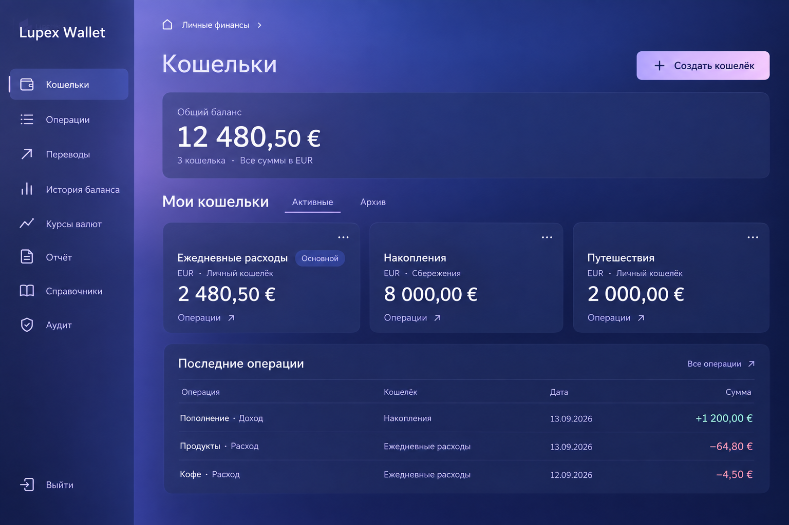

# Визуальный эталон Lupex Wallet

Обновлено 2026-09-14. Текущее направление — **UI kit v0.3 / Indigo Glass**. Пользователь выбрал последний полный экран «Кошельки» для фиксации. HTML/CSS-макет подготовлен для проверки и последующего переноса; внедрение v0.3 в Angular не выполнено этим изменением.

## Что открыть

- [Экран «Кошельки»](wallets.html) — основной воспроизводимый образец.
- [Полная форма кошелька](wallet-form.html) — создание, редактирование, дополнительные настройки и ошибки.
- [Экран «Операции»](operations.html) — фильтры, таблица, создание/редактирование и подтверждения.
- [Спецификация новых экранов v0.3](screen-spec.md) — поля, правила, состояния и границы макетов.
- [Выбранная картинка](assets/wallets-reference-v0.3.png) — композиция и визуальный ориентир.
- [UI kit](ui-kit.md) — правила компонентов, адаптации и состояний.
- [Токены](tokens.css) — точные значения цвета, типографики, геометрии и эффектов.
- [Витрина компонентов](preview.html) — те же токены на кнопках, полях, формах и таблицах.
- [Исходный референс](assets/visual-reference.png) — настроение и исходная палитра; городской арт допустим на Login, не под рабочей таблицей.
- [Проверка макета](verification.md) — выполненные проверки и ограничения.



Изображение создано встроенным imagegen и сохранено в репозитории без изменения. Это выбранный визуальный ориентир, не скриншот работающего приложения. В HTML точные размеры взяты из UI kit, поэтому масштаб текста и переносы могут отличаться от генерации.

## Запуск

Открыть `docs/design/wallets.html` непосредственно в браузере: внешних шрифтов, библиотек, сборки и API нет. Для воспроизводимой локальной проверки из корня репозитория:

```text
node docs/design/serve.mjs
```

Затем открыть <http://127.0.0.1:4319/wallets.html>. Сервер слушает только loopback и отдаёт только разрешённые типы файлов из `docs/design/`; остановка — Ctrl+C.

## Что закреплено

- Полная компоновка: навигация, общий баланс, карточки, последние операции. Уменьшение декоративного шума не означает удаление содержимого.
- Исходная палитра индиго, лаванды и мягкого розового. Primary остаётся лавандово-розовым градиентом.
- Спокойный CSS-фон рабочего экрана, без городской иллюстрации.
- Полупрозрачные панели, едва заметный верхний край, слабые разделители. Нет неоновых рамок, светящихся полос, ореолов и glow на hover.
- Обычный текст и числа не светятся. Поля, ошибки и клавиатурный focus сохраняют необходимые контрастные признаки.
- Текстовые вкладки с подчёркиванием. Без аватаров, уведомлений и декоративных функций.

## Как пользоваться макетом

«Активные / Архив» переключаются мышью и стрелками, Home/End. «Операции» в карточке открывает полный экран с фильтром по этому кошельку; «Все операции» открывает весь список. Меню карточки закрывается Escape. На tablet/mobile «Меню» показывает навигацию; Escape возвращает фокус к кнопке.

Внизу находится свёрнутая секция «Проверка макета»: обычное, пустое, загрузка, ошибка и длинные значения. Ошибка показывает «Повторить»; неизвестный баланс не заменяется нулём. При тесте длинных сумм таблица скрывается, чтобы не выдавать прежние строки за объяснение нового баланса.

«Создать кошелёк» и «Редактировать» открывают полную форму `wallet-form.html` в соответствующем режиме. Дополнительные настройки свёрнуты при создании. Внизу формы можно проверить редактирование основного кошелька, загрузку справочников, ошибки и сохранение. В Operations работают фильтры и «Загрузить ещё»; меню строки открывает допустимые действия. Контрольная дата демонстрации — 14.09.2026.

Макеты используют вымышленные данные. Результат формы кошелька — локальное подтверждение; список карточек на другой странице не изменяется. Добавление, изменение и удаление операций работают только в памяти страницы и исчезают после обновления. Остальные пункты навигации сообщают, что экран ещё не подготовлен. «Выйти» не завершает сессию приложения. Запросов к API и постоянного хранения нет.

## Передача Claude / разработчику

1. Прочитать `ui-kit.md` и `screen-spec.md`, открыть три экранных макета и выбранную картинку. Этот пакет уточняет декор v0.2 из ADR-0014; старые интенсивные эффекты не копировать.
2. Палитру и размеры брать из `tokens.css`. Фон и материалы применять в shared/layout, без локальных конкурирующих оттенков. Новые токены поверхности не подменяют `--lw-control-border` полей.
3. При переносе удалить не только старое значение `--lw-glow`, но и жёстко прописанные glow/hover-shadow в компонентах. Обновить `--lw-shadow`, `--lw-border-light`, `--lw-panel-reflection` и использовать `--lw-surface-border` / `--lw-divider` по назначению.
4. Структура и бизнес-правила приложения сохраняются. Общий баланс и «Последние операции» здесь — композиционный образец на данных одной валюты. Наличие секции на картинке не разрешает добавлять API, конвертацию или складывать разные валюты. Перед внедрением связать секции с существующими сценариями и контрактами; нехватку данных зафиксировать отдельно.
5. Сначала перенести один настоящий экран Wallets и сравнить его с HTML при одинаковом viewport. Выполнить проверки на 360/768/1440 px, длинных значениях, увеличении масштаба, клавиатуре, пустых/ошибочных/загрузочных состояниях. Скриншот документации не заменяет скриншот приложения.
6. Полная форма кошелька и Operations уже оформлены в этом пакете. Использовать их для следующих экранов Angular после оценки макетов. Затем подготовить Transfers и оставшиеся экраны; не менять палитру и эффекты при каждом новом экране.

Старые записи об утверждении/внедрении v0.2 в `docs/PROGRESS.md` описывают историю. Они не означают, что v0.3 уже перенесена или что новый HTML проверен пользователем.
